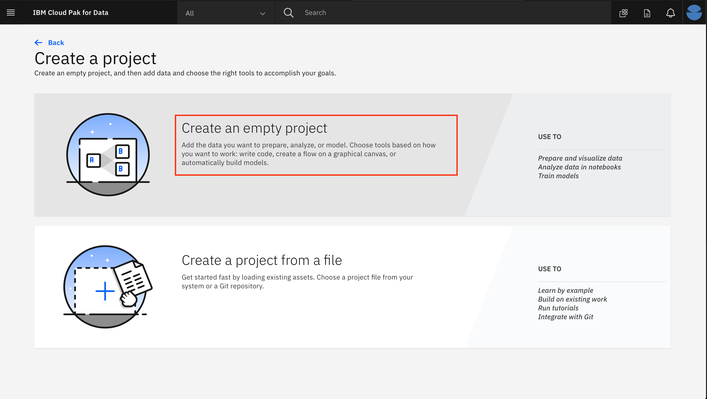
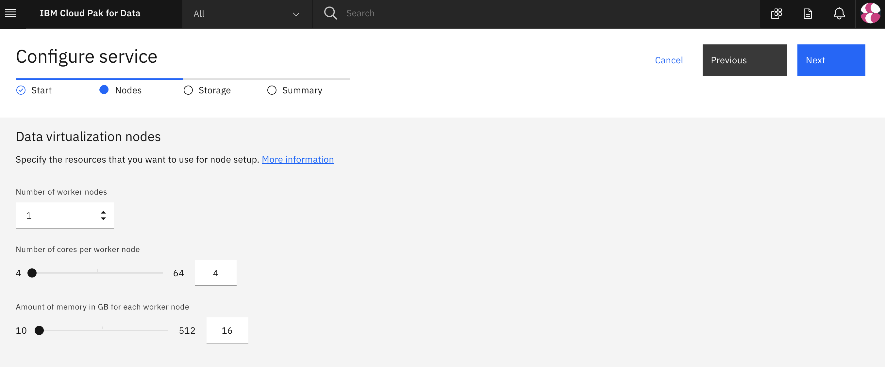
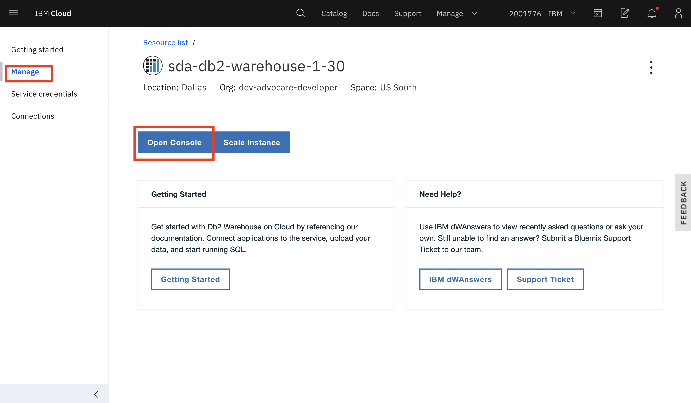
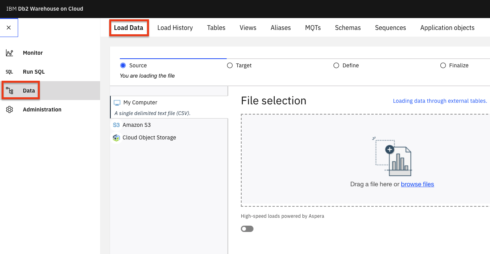
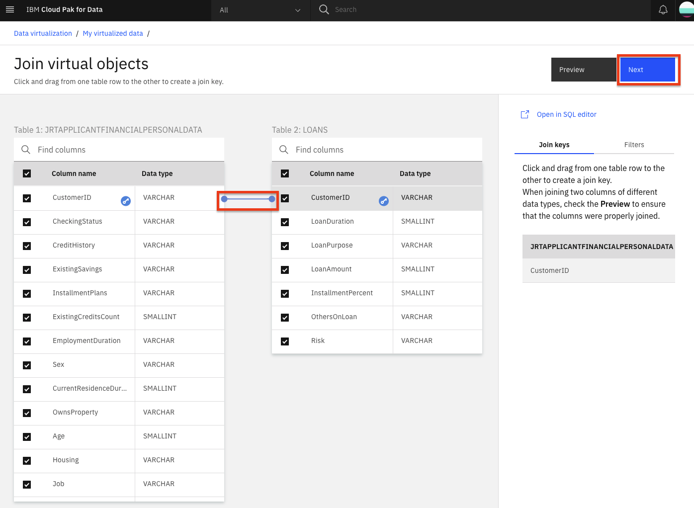

---
also_found_in:
- /learningpaths/cloud-pak-for-data-learning-path/
authors:
- email: scott.dangelo@ibm.com
  name: Scott D'Angelo
- email: jrtorres@us.ibm.com
  name: Javier Torres
completed_date: '2019-11-25'
components:
- cloud-pak-for-data
- ibm-db2-warehouse
- netezza-performance-server
display_in_listing: true
draft: false
excerpt: IBM Cloud Pak for Dataのデータ仮想化を利用して、複数のデータソースにまたがるクエリを迅速かつ容易に行うことができます。
ignore_prod: false
last_updated: '2021-07-14'
meta_description: IBM Cloud Pak for Dataのデータ仮想化を利用して、複数のデータソースにまたがるクエリを迅速かつ容易に行うことができます。
meta_keywords: IBM Cloud Pak for Data, Data Virtualization, Db2 warehouse, databases
meta_title: IBM Cloud Pak for Dataでのデータ仮想化
primary_tag: analytics
subtitle: IBM Cloud Pak for Dataのデータ仮想化を利用して、複数のデータソースを横断してクエリを実行する
tags:
- data-management
- data-science
- databases
title: IBM Cloud Pak for Dataでのデータ仮想化
---

何十年もの間、企業はサイロ化を解消するために、さまざまな業務システムからデータマート、データウェアハウス、データレイクなどの中央データストアにデータをコピーして分析しようとしてきました。しかし、これには多くのコストがかかり、エラーも発生しがちです。ほとんどの企業は、構造や種類が異なる平均33個の独自のデータソースを管理するのに苦労しており、見つけにくく、アクセスしにくいデータサイロに閉じ込められていることが多いのです。

データ仮想化*を使えば、データをコピーしたり複製したりすることなく、多くのシステムでデータを照会できるので、コスト削減につながります。また、最新のデータをソースから照会できるため、分析が簡素化され、より最新で正確な分析が可能になります。

このチュートリアルでは、IBM Cloud Pak for Data 上のデータ仮想化を使用して、複数のデータ・ソースにまたがるクエリーを作成する方法を学びます。この例では、Netezza Performance Server または Db2 Warehouse を使用しますが、IBM Data Virtualization 用の組み込みコネクターを持つ多くのデータベース、または JDBC コネクターを持つ任意のデータベースから選択できます。

## 学習目標

このチュートリアルでは、以下の方法を学びます。

* IBM Cloud Pak for Data にデータセットを追加します。
* データ仮想化のためのデータ・ソースを追加する。
* データを仮想化して結合ビューを作成する。
* 仮想化されたデータをプロジェクトに割り当てる。
* ユーザーにロールを追加し、管理タスクを実行する。

## 前提条件

* [IBM Cloud Pak for Data](https://www.ibm.com/analytics/cloud-pak-for-data)
* [IBM Cloud Account](https://www.ibm.com/cloud)
* 1つまたは複数のデータソース

## 見積もり時間

このチュートリアルは、約30～45分で完了します。

## Step 1.データの取得

3つのデータファイルをダウンロードします。

1.[申請者_財務データ.csv](static/applicant_financial_data.csv)
1.[申請者_loan_data.csv](static/applicant_loan_data.csv)
1.[applicant_personal_data.csv](static/applicant_personal_data.csv)

## Step 2.データセットについて

ここでは、信用リスク/融資のシナリオを使用します。このシナリオでは、貸し手は、リスクモデリングへの異なるアプローチを使用して、より大きく多様な対象者への貸し出しを拡大するという圧力の増加に対応します。これは、伝統的な信用データソースを超えて、代替的な信用データソース（携帯電話プランの支払い履歴、学歴など）に移行することを意味しており、バイアスやその他の予期せぬ相関関係のリスクをもたらす可能性があります。

今回のワークショップで検討している信用リスクモデルは、各ローン申請者に関する20の属性を含むトレーニングデータセットを使用しています。シナリオとモデルは、<a href="https://archive.ics.uci.edu/ml/datasets/Statlog+(German+Credit+Data)">UCI German Credit dataset</a>に基づいた合成データを使用しています。

#### [Applicant Financial Data](static/applicant_financial_data.csv)

このファイルの属性は以下の通りです。

* CUSTOMERID (16進数、主キーとして使用)
* チェックステータス
* クレディセゾン
* 貯蓄残高
* 分割払いプラン
* 既存のクレジットカウント

#### **[Applicant Loan Data](static/applicant_loan_data.csv)**。

このファイルの属性は以下の通りです。

* CUSTOMERID
* LOANDURATION
* LOANPURPOSE
* LOANAMOUNT
* 分割払いのパーセンテージ
* OTHERSONLOAN
* リスク(Risk)

#### **[申請者個人データ](static/applicant_personal_data.csv)**。

このファイルの属性は以下の通りです。

* CUSTOMERID
* Employmentduration
* SEX
* currentesidenceduration
* OWNSPROPERTY
* 年齢
* 住まい
* 職務
* 扶養家族
* 電話
* 外国人労働者
* FIRSTNAME (ファーストネーム)
* LASTNAME (ラストネーム)
* ♪Eメール
* Streetaddress
* CITY
* STATE
* POSTALCODE

## Step 3.プロジェクトをセットアップし、IBM Cloud Pak for Data上でデータ仮想化をプロビジョニングします。

### IBM Cloud Pak for Data にログインします。

ブラウザを起動して、IBM Cloud Pak for Data のデプロイメントに移動します。

  

### 新しい IBM Cloud Pak for Data プロジェクトを作成します。

IBM Cloud Pak for Data では、特定の目標を達成するために使用するリソース (問題に対するソリューションを構築するためのリソース) を収集/整理するために、プロジェクトという概念を使用しています。プロジェクトのリソースには、データ、共同研究者、ノートブックやモデルなどの分析資産などがあります。

* (☰)ナビゲーションメニューの「プロジェクト」セクションで、「**すべてのプロジェクト**」をクリックします。

  

* 右上の **新規プロジェクト** ボタンをクリックします。

  

* **Analytics project**のラジオボタンを選択し、**Next**ボタンをクリックします。

  

* **Create an empty project** を選択します。

  

* プロジェクトの名前とオプションの説明を入力し、**Create**をクリックします。

  

### IBM Cloud Pak for Data でのデータ仮想化のプロビジョニング

* 左上（☰）のハンバーガーメニューから、**サービス>インスタンス**オプションをクリックします。

* インスタンスの一覧から「データ仮想化」サービスを探し、アクションメニュー（縦3つのドット）をクリックして、**インスタンスのプロビジョニング**を選択します。

* Configure service > Startページで、automatic semaphore configurationのチェックボックスを有効にし、 **Next**ボタンをクリックします。

  

* Configure service > Nodes ページでは、デフォルトのシングルノードとリソースの割り当てのまま、 **Next** ボタンをクリックします。

  > **Note:** 64GB以上のRAMを持つDVインスタンスを構成しようとすると、以前は構成エラーが発生していました。

  

* Configure service > Storage ページで、永続的ストレージとキャッシュストレージの両方のストレージクラスとして *ibmc-file-gold-gid* を選択する必要があります。その後、**Next**ボタンをクリックします。

  

* Configure service > Summary ページで、**Configure** ボタンをクリックします。

  

* 設定作業には時間がかかる場合があります。

## Step 4.1つまたは複数のデータベースの設定

IBM Cloud Pak for Data は、JDBC コネクターを持つあらゆるデータベースと連携できます。このチュートリアルでは、IBM Db2 Warehouse on IBM Cloud、IBM Db2 local on IBM Cloud Pak for Data、および Netezza Performance Server を使用してデモを行います。これらのうちの1つまたは2つ、3つすべて、または他のデータベースの組み合わせを使用することができます。

### Netezza Performance Serverのセットアップ

#### Netezza を使ってテストする場合は、以下の手順で行ってください。

IBM Netezza Performance Serverへの接続を行う前に、必要なテーブルを作成し、`nzload` cliを使って`csvデータ`をIBM Netezza Performance Serverサーバーにロードする必要がある。nzload` cliをインストールするには、[instruction](https://www.ibm.com/support/knowledgecenter/en/SS5FPD_1.0.0/com.ibm.ips.doc/postgresql/admin/t_sysadm_installing_linux_unix_clients.html)に従う。

IBM Netezza Performance Serverのコンソールにログインし、[Applicant Loan Data](static/applicant_loan_data.csv)、[Applicant Financial Data](static/applicant_financial_data.csv)、[Applicant Personal Data](static/applicant_personal_data.csv)の3つのテーブルを作成する。

なお、これらのテーブルは、`nzload`を使ってデータをロードする前に存在している必要があります。その後、`nzload`のCLIコマンドを使ってCSVデータをNetezza Performance Serverデータベースにロードすることができます。

```
bash

nzload -u <user> -pw <password> -host <host> -db <database> -t <table name> -delim ',' -df <csv file name>
```

もし、`nzload`というCLIがサポートされていない場合（Mac OSXなど）は、提供されたCSVデータに対してインサートステートメントを作成し、Netezzaコンソールから実行する必要がある。これは`nzload`コマンドより少し時間がかかるかもしれません。

### IBMクラウドでDb2ウェアハウスをセットアップする

#### DB2 Warehouse on IBM Cloudでテストする場合は、以下の手順で行ってください。

Db2 Warehouse on IBM Cloud](https://cloud.ibm.com/catalog/services/db2-warehouse?cm_sp=ibmdev-_-developer-tutorials-_-cloudreg)を使用することで、クラスター上のリソースを最適に節約することができます。クラスター上でローカルのDb2を使用する場合は、このセクションをスキップし、代わりに[set up the local Db2-warehouse on IBM Cloud Pak for Data](#step-5 set-up-the-local-db2-warehouse-on-ibm-cloud-pak-for-data)を使用します。

**注意**。続行する前に、IBM Cloud上でDb2ウェアハウスをプロビジョニングしていることを確認してください。

* サービスのプロビジョニングが完了したら、「Service Credentials」にアクセスし、「**New credential +**」をクリックします。View credentials」を開き、後で使用するためにクレデンシャル（これは接続の詳細です）をコピーします。

  

#### クラウド上のDb2 Warehouseにデータをロードする

* ここでManageに移動し、**Open Console**をクリックします。

  

* 左上（☰）のハンバーガーメニューから、**Data**をクリックし、**Load data**タブをクリックします。

  

* ページのFile Selectionセクションにある**browse files**リンクをクリックし、このリポジトリをダウンロードした場所に移動し、次に`data/split/`に移動して`applicant_financial_data.csv`を選択し、**Next**ボタンをクリックします。

* **+ New Schema** をクリックして、名前を `CP4DCREDIT` にします。

* 新しいスキーマを選択した状態で、 **+ 新しいテーブル** をクリックします。新しいテーブル名」に「APPLICANTFINANCIALDATA」と入力し、「Create > Next**」をクリックします。デフォルトを受け入れて、**Next**をクリックし、**Begin Load**をクリックします。

* テーブル名を `APPLICANTPERSONALDATA` にして、`applicant_personal_data.csv` ファイルのデータロード手順を繰り返します。

* `applicant_loan_data.csv` ファイルに対するデータロードのステップを繰り返し、テーブル `LOANS` に名前を付けます。

#### SSL証明書の取得

* IBM Cloud Db2 Warehouse インスタンスを使用するには、IBM Cloud Pak for Data の SSL 証明書が必要です。

* Db2 Warehouseコンソールで、左上（☰）のハンバーガー・メニューから「**Adminsitration**」をクリックし、次に「**Connections**」タブをクリックします。SSL証明書のダウンロード」ボタンをクリックします。

   

* [openssl](https://www.openssl.org/)を使って、SSL証明書を`.crt`から`.pem`ファイルに変換する必要があります。以下のコマンドを実行してください。

  ``bash
  openssl x509 -in DigiCertGlobalRootCA.crt -out DigiCertGlobalRootCA.pem -outform PEM -inform DER
  ```

* このファイルを後で使用するために保存してください。

これでDb2 WarehouseがIBM Cloud上にセットアップされたので、[add a new data source connection](#step-6-add-a-new-data-source-connection)にスキップすることができます。

### IBM Cloud上でローカルDb2 Warehouseをセットアップする Pak for Data
 
#### Db2 Warehouse on IBM Cloud Pak for Dataでテストする場合は、以下の手順を使用してください。

これらの手順は、ローカルの IBM Cloud Pak for Data バージョンの Db2 Warehouse にデータをロードするためのものです。Db2 WarehouseのIBM Cloudインスタンスを使用している場合は、[次のセクション](#step-6-add-a-new-data-source-connection)にスキップできます。Db2 Warehouse on IBM Cloud](https://cloud.ibm.com/catalog/services/db2-warehouse?cm_sp=ibmdev-_-developer-tutorials-_-cloudreg)を使用して、[set up the Db2 warehouse on IBM Cloud](#step-4-set-up-the-db2-warehouse-on-ibm-cloud)で説明されているように、IBM Cloud Pak for Dataクラスターのリソースを節約することが推奨されています。クラスター上のローカルDb2を使用したい場合は、このセクションを続けてください。

なお、IBM Cloud Pak for Dataは、JDBCコネクターを持つあらゆるデータベースと連携できるため、Db2ウェアハウスは数ある選択肢の1つに過ぎません。

* ここでは、Db2アセンブリのインストール、データベースの配置の作成、Data Management Console (DMC)アセンブリのインストール、DMCサービス・インスタンスのプロビジョニングなど、クラスターがすでにセットアップされていることを前提としています。

* IBM Cloud Pak for Data インスタンスに管理者としてログインします。左上（☰）のハンバーガーメニューから、**Data > Databases**をクリックします。

* データベース・インスタンス・タイルの3つの縦ボタンをクリックし、**Open database**メニュー項目をクリックします。

* ページの左上にあるデータベースのドロップダウンメニューをクリックし、**接続情報**オプションをクリックします。

  

* 接続情報は後で使用されるので、メモしておいてください。

**重要**です。少なくとも1つのOpenShiftノードがdb2whのタグ（`icp4data=database-db2wh`など）を持っている必要があります。そうでない場合は、ローカルDb2ウェアハウスのプロビジョニングができません。このタグは、以下のコマンドで設定できます。

> `oc label node <NODE> icp4data=database-db2wh` とします。

#### ローカルDb2ウェアハウスの接続詳細の取得

ローカルDb2ウェアハウスの接続情報を取得するには、ハンバーガー（☰）メニューで「**My Instances**」オプションをクリックします。

  

次に、［Provisioned instances］タブに移動し、ローカルDb2 Warehouseの行をクリックします。これにより、Db2 Warehouseインスタンスの詳細が表示されます。


このウィンドウを別のタブで開いておくか、必要な接続情報をコピーします。ホスト、ポート、データベース名、ユーザー名、およびパスワードです。ポートは、JDBC 接続 URL から取得できます。たとえば、jdbc:db2://10.221.243.172:31956/BLUDB という URL の場合、ポートは URL のコロンの後の数字になります。31956.


#### IBM Cloud Pak for Data上のローカルDb2ウェアハウスのデータをロードします。

* 左上のハンバーガー（☰）メニューをクリックし、「**Collect > My data**」を選択します。

    

* 「データベース」タブに移動し、「**Db2 Warehouse**」タイルの3本の縦線をクリックし、「**Open database**」をクリックします。

    

* [Summary]で、**Load > Load Data**を選択します。

    

* ページのFile Selectionセクションにある**browse files**リンクをクリックして、このリポジトリをダウンロードした場所に移動し、次に`data/split/`に移動して`applicant_financial_data.csv`を選択し、**Next**ボタンをクリックする。

* **+ New Schema** をクリックして、名前を `CP4DCREDIT` にします。

* 新しいスキーマを選択した状態で、 **+ 新しいテーブル** をクリックします。新しいテーブル名」に「APPLICANTFINANCIALDATA」と入力し、「Create > Next**」をクリックします。デフォルトを受け入れ、**Next**、**Begin Load**の順にクリックします。

* テーブル名を `APPLICANTPERSONALDATA` にして、`applicant_personal_data.csv` ファイルのデータロード手順を繰り返します。

* `applicant_loan_data.csv` ファイルに対するデータロードのステップを繰り返し、テーブル `LOANS` に名前を付けます。

## Step 6.新しいデータソース接続の追加

IBM Cloud Pak for Dataは、IBM Db2 Warehouse on cloud、IBM Db2 local and Netezza Performance Server、MongoDBなど、あらゆるデータベースと連携できます。それらを利用して、以下のステップで接続を設定し、データソースとして追加することができます。

  > **Note:** データソースがリモートデータセンター（IBM Cloud Pak for Dataインスタンスと同じデータセンターではない）にある場合、リモートコネクターを使用してデータソース接続のパフォーマンスを向上させることができます。Improve performance for your data virtualization data sources with remote connector](https://developer.ibm.com/tutorials/improve-performance-for-your-database-connections-with-remote-connectors/)のチュートリアルの指示に従って、データソースのリモートコネクタを設定します。

### 接続情報の取得

Db2 warehouse on IBM CloudやNetezza Performance Serverなどのデータベースを使用している場合は、上記の[ステップ4](#-get-connection-details-for-db2-warehouse-on-ibm-cloud)の一部として提供されている手順を使用して、JDBC接続の詳細とSSL証明書を取得していることを確認してください。

IBM Cloud Pak for Data上のローカルDb2ウェアハウスを使用している場合は、上記の[ステップ5](#-get-connection-details-for-local-db2-warehouse)の一部として提供されている手順を使用して、JDBC接続の詳細を取得していることを確認してください。

### 新しいデータソースの追加

* 新しいデータソースを追加するには、(☰)ナビゲーションメニューの[データ]セクションで、 **プラットフォーム接続**をクリックします。

  

*概要で、**新規接続**ボタンをクリックします。

  

* 新しい接続に名前を付けて開始し、接続タイプを選択します。(IBM Db2データベースの場合は、接続タイプとして**Db2 Warehouse on Cloud**を、Netezza Performcanceサーバーの場合は**PureData System For Analytics**を選択します)。

* 次の画面で、新しい接続に名前を付けます。また、接続のHost、Port、Database、Username、Passwordの値を入力します（これらの値は、インスタンスのプロビジョニング時に保存した値であることに注意してください）。

* Db2 Warehouse on Cloudの場合、「Use SSL」のチェックボックスが選択されていることを確認し、Db2 WarehouseのSSL証明書の内容（おそらくDigiCertGlobalRootCA.pemという名前）をコピー＆ペーストします。

  > Db2 WarehouseのSSL証明書（DigiCertGlobalRootCA.pem）の内容をコピーして貼り付けます（注）。

* すべての接続情報を入力したら、まず **Test Connection** ボタンをクリックし、それが成功したら **Save** ボタンをクリックしてください。

  

* 新しい接続が概要に表示されます。

> **Note:** このセクションを完了するには、IBM Cloud Pak for Data プラットフォームの Admin または Data Engineer ロールが必要です。

## データの仮想化

このセクションでは、データ仮想化ツールを使用して、IBM Cloud Pak for Dataで接続として公開されているIBM Db2 Warehouse、Netezza Performance Server、MongoDBなどの任意のデータベースからデータをインポートします。データ仮想化を使用してこれらのテーブルにアクセスし、その仮想化されたテーブルに対して結合ビューを作成します。

### 仮想化テーブルの作成

* データ仮想化ツールを起動するには、(☰)ナビゲーションメニューの「**データ**」セクションで、「**データ仮想化**」をクリックします。

  

* ページの左上にあるデータ仮想化のサブメニューから、メニューのドロップダウンリストをクリックして **仮想化** を選択します。

  

* データ仮想化サーバーに含まれるデータソースのいずれかに、いくつかのテーブル名が表示されます。パネルの上部には、データベースの種類を選択することで、表示されるテーブルをフィルタリングできることがわかります。

* 使用するテーブルの検索を簡単にするために、`Schemas`列のヘッダーをクリックして、テーブルをスキーマでソートします。そして、今回のワークショップで使用するテーブルを探します。CP4DCREDIT`スキーマの下にある`APPLICANTFINANCIALDATA`、`APPLICANTPERSONALDATA`、`LOANS`です。これら3つのテーブルの横にあるチェックボックスを選択して、**Add to cart > View Cart**をクリックしてください。

> **Note:** テーブルビューの下部にある右矢印をクリックするか、テーブルビューの左下にある「1ページあたりのアイテム数」を大きな値に変更することで、利用可能なテーブルをページングする必要があるかもしれません。

  

* 次のパネルでは、仮想化されたテーブルをどこに割り当てるかを選択するよう求められます。My virtualized data**ラジオボタンを選択し、**Virtualize**ボタンをクリックすると、仮想化されたテーブルがデータに追加されます（デフォルト値のままなので、テーブルは元のテーブルと同じテーブル名で独自のユーザースキーマの下で仮想化されます）。

  

* 仮想テーブルが作成されたことを示すポップアップダイアログパネルが表示されます。View my virtualized data**ボタンをクリックして、新しい仮想化テーブルを確認してみましょう。

  

> **Note:** ページ上部に仮想アセットがカタログに公開されたことを示す通知が表示されることがあります。この通知は `X` をクリックすることで自由に解除することができます。

### 参加型バーチャルビューの作成

ここでは、先に仮想化したテーブルを結合して、最終的にマージされたデータセットを作成します。この作業は、3つの異なるデータセットを扱うコードをノートに書くよりも、ここで行う方が簡単です。

* My virtualized data」ページで、仮想化した2つのテーブル（「APPLICANTPERSONALDATA」と「APPLICANTFINANCIALDATA」）をクリックし、「**Join**」ボタンをクリックします。

  

* テーブルを結合するには、両方のデータセットに共通するキーを選択する必要があります。ここでは、1つ目のテーブルの `CustomerID` を2つ目のテーブルの `CustomerID` にマッピングすることにします。これを行うには、1つのテーブルをクリックして、別のテーブルにドラッグします。ここでは、すべての列名を選択するというデフォルトのままにしておきます。線が引かれたら、**Next**ボタンをクリックしてください。

  

* 次のパネルでは、列の名前を変更することもできますが、既存の列の名前を受け入れます。次へ」ボタンをクリックして続けてください。

  

* 次のパネルでは、結合されたデータビューに一意の名前を付けます（SQLの標準と一致させるために、すべて大文字の名前を選んでください）。XXXAPPLICANTFINANCIALPERSONALDATA`（`XXX`はあなたのイニシャルをすべて大文字で表したもの）のように選択します。また、**My virtualized data** ラジオボタンを選択し、**Create view** ボタンをクリックすると、仮想化されたアグリゲートビューがデータに追加されます。

  

* 結合ビューの作成が成功したことを示すポップアップ・ダイアログ・パネルが表示されます。View my virutalized data**ボタンをクリックしてください。


* 上記と同じ手順を繰り返しますが、今回は先ほど作成した新しいジョイン・ビュー（`XXXAPPLICANTFINANCIALPERSONALDATA`）と最後の仮想化テーブル（`LOANS`）を結合することを選択し、3つのテーブルをすべて含む新しいジョイン・ビューを作成します。Join**」ボタンをクリックします。

  

* もう一度、最初のテーブルの `CustomerID` を 2 番目のテーブルの `CustomerID` に選択/マッピングすることで、2 つのテーブルを結合します。これを行うには、1つのテーブルをクリックして、別のテーブルにドラッグします。ここでは、すべての列名を選択するというデフォルトのままにしておきます。線が引かれたら、 **次へ** ボタンをクリックしてください。

  

* 次のパネルでは、列の名前を変更することもできますが、既存の列の名前を受け入れます。次へ」ボタンをクリックして次に進みます。

* 次のパネルでは、結合されたデータビューに一意の名前を付けます（SQLの標準と一致させるために、すべて大文字の名前を選択します）。XXXAPPLICANTFINANCIALPERSONALLOANSDATA`（`XXX`はあなたのイニシャルをすべて大文字で表したもの）のように選択します。また、**My virtualized data**ラジオボタンを選択し、**Create view**ボタンをクリックすると、仮想化されたアグリゲートビューがデータに追加されます。

* 集約ビューの作成が成功したことを示すポップアップ・ダイアログ・パネルが表示されます。View my virtualized data**ボタンをクリックします。

* 「My virtualized data」ページには、3つの仮想化テーブルと2つの結合テーブルがすべて表示されています。すべてのテーブルが表示されるまで、次のセクションには進まないでください。

  

### 仮想化データへのアクセス許可

先ほど仮想化したデータに他のユーザーがアクセスするためには、アクセス権を付与する必要があります。以下の手順で、仮想化したデータを他のユーザーに見えるようにします。

* ハンバーガー（☰）メニューから「**データ仮想化**」に移動します。メニュー＞My virtualized data**をクリックします。

* 作成した仮想化データをクリックし、右側の縦3つの点をクリックして、**アクセスの管理**を選択します。

  

* **Specific users** ラジオボタンをクリックして、**Add user +** を選択します。

  

* アクセスを許可したいユーザーを選択し、**Add users**をクリックします。

  

残りのテーブルやビューについても、上記の手順を繰り返します。

### ユーザーに Engineer ロールを割り当てます。

データ仮想化機能を使用する必要がある IBM Cloud Pak for Data のユーザーには、職務内容に応じて特定のロールを割り当てる必要があります。その役割とは、Admin、Engineer、User、Steward です。

一部のユーザーにEngineerロールを割り当ててみましょう。

* ハンバーガー（☰）メニューから「**データ仮想化**」を選択し、「**My virtualized data > User management**」をクリックします。

  

* **ユーザーの追加 +** をクリックし、ユーザーの役割をエンジニアに更新します。

  

## Step 7.ユーザーが仮想化データを割り当てる

次に、仮想化データにアクセスできるユーザーが、そのデータを自分のプロジェクトに割り当てる方法、つまり、仮想化データをプロジェクトのアセットとして追加する方法を見てみましょう。

* ページの左上にあるデータ仮想化サブメニューから、メニューのドロップダウンリストをクリックし、**My virtualized data**を選択します。ここには、自分が仮想化したデータや、アクセス権を与えられた（または管理者が割り当てた）データが表示されているはずです。

  

* プロジェクトで使用したいデータセットの横にあるチェックボックスを選択し、 **Assign** ボタンをクリックすると、プロジェクトへのインポートが開始されます。

> **Note:** 選択するデータ資産の名前は、データ仮想化の際に選択された名前に基づいて異なる場合があります。デフォルトでは、「LOANS」、「APPLICANTFINANCIALDATA」、「APPLICANTPERSONALDATA」、「APPLICANTFINANCIALPERSONALDATA」、「APPLICANTFINANCIALPERSONALLOANDATA」が選択されます。

  

*「Assign virtual objects」画面で、ドロップダウンリストからアナリティクスプロジェクトを選択します。その後、**Assign**ボタンをクリックして、データをプロジェクトに追加します。

  

* `Publish virtual assets to catalog` ポップアップパネルで、**Publish** ボタンを選択して、これらのアセットをカタログに公開します。

  

* ポップアップパネルには、オブジェクトがプロジェクトに割り当てられたことを確認するメッセージが表示されます。Go to project**」ボタンをクリックします。

  

* プロジェクト ページで **Assets** タブをクリックすると、現在プロジェクトに含まれる仮想化テーブルと結合テーブルが表示されます（プロジェクトに含まれる他のアセットも表示されます）。

 **プロジェクト内のデータ資産が表示されるまで先に進まないでください**。

## Conclusion

このチュートリアルでは、データが格納されているデータベースへの接続方法、データベースを仮想化する方法、仮想化されたデータの利用方法を紹介しました。

必要に応じて、異なるデータベースやサーバーのデータを追加することができます。さらに、異なるソースからのデータを一緒に仮想化することもできます。目標は、誰がどのデータにアクセスできるかを完全にコントロールしながら、すべてのデータサイエンティストが車輪を再発明することなくデータを使用できるように、早い段階でデータをプラットフォームに導入することです。